# Taxi — разработка и реализация базы данных «Такси» (MySQL) с клиентским приложением на PyQt6

[](README.en.md)


Курсовой проект по дисциплине «Базы данных», Донской государственный технический университет (ДГТУ), 2024.
Тема: **«Разработка и реализация базы данных «Такси»**.

## О проекте

Основная часть работы — **проектирование и реализация реляционной базы данных службы такси** в MySQL: от анализа предметной области и ER-модели до нормализации, физической схемы, хранимых процедур и триггеров аудита. Чтобы показать базу в работе, к ней написано настольное приложение на Python (PyQt6) с тремя ролями: **клиент**, **водитель** и **администратор**.

### Что сделано

- проанализирована предметная область и выделены три роли пользователей и 11 сущностей;
- построена ER-диаграмма, описаны связи и функциональные зависимости;
- отношения нормализованы до **третьей нормальной формы (3НФ)**;
- составлена даталогическая схема и реализована база в **MySQL** (11 таблиц, первичные и внешние ключи, ограничения);
- написаны **хранимые процедуры** для всех операций записи (регистрация, вход, заказы, чаты, отзывы, услуги);
- созданы **триггеры**, которые перед каждым изменением данных сохраняют копию записи в журнал аудита в формате JSON;
- реализован клиентский интерфейс, который работает с базой через процедуры и параметризованные запросы.

## Проектирование базы данных

### Пользователи и их задачи

| Роль | Что делает с данными |
| ---- | -------------------- |
| **Клиент** | Создаёт заказ, общается с водителем и поддержкой в чате, оставляет отзыв с оценкой, просматривает историю заказов и отзывов |
| **Водитель** | Просматривает и принимает активные заказы, ведёт чат с клиентом, завершает заказ, вносит данные об обслуживании автомобиля, смотрит историю заказов и отзывы |
| **Администратор** | Имеет все права водителя, а также управляет сотрудниками, клиентами, автомобилями, услугами и отзывами, отвечает в чате поддержки |

Из требований выделены 11 сущностей: **сотрудник, клиент, машина, рабочая смена, заказ, отзыв, чат, сообщение, услуга, оказанная услуга, медосмотр**.

### ER-диаграмма

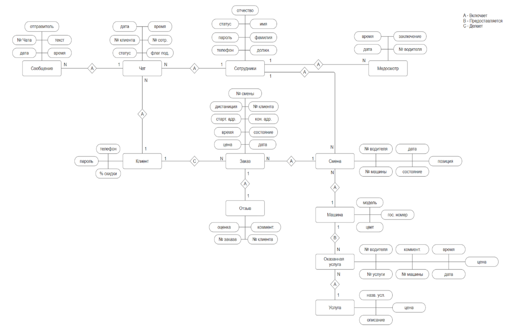

Типы связей (все связи «один ко многим», кроме заказа и отзыва):

| Связь | Тип | Смысл |
| ----- | --- | ----- |
| `client` → `order_client` | 1 : N | Клиент делает много заказов |
| `work_shift` → `order_client` | 1 : N | В смену выполняется много заказов |
| `order_client` → `feedback` | 1 : 1 | У заказа один отзыв |
| `worker` → `work_shift` | 1 : N | У сотрудника много смен |
| `car` → `work_shift` | 1 : N | Машина работает в разные смены |
| `client` → `chat`, `worker` → `chat` | 1 : N | У клиента и у сотрудника может быть много чатов |
| `chat` → `message` | 1 : N | В чате много сообщений |
| `worker` → `medical` | 1 : N | У сотрудника много медосмотров |
| `car` → `service_rendered`, `service` → `service_rendered` | 1 : N | Услуга оказывается автомобилю |

### Нормализация

1. **1НФ.** Все атрибуты атомарны, значения не являются списками.
2. **2НФ.** В каждом отношении первичный ключ простой (не составной), поэтому неключевые атрибуты полностью зависят от ключа.
3. **3НФ.** Транзитивные зависимости устранены декомпозицией: данные работников и клиентов вынесены в отдельные отношения.

Итог: минимальная логическая избыточность и меньшая вероятность аномалий вставки, обновления и удаления.

### Даталогическая схема

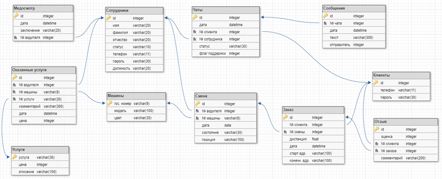

## Физическая реализация в MySQL

### Почему MySQL

Рассматривались Oracle Database, MS SQL Server, PostgreSQL и MySQL. Выбран **MySQL**: он бесплатный, кроссплатформенный, надёжный и производительный, хорошо поддерживается из Python (`mysql-connector-python`), а его моделирование и администрирование удобно вести в MySQL Workbench.

### Схема таблиц


| Таблица | Назначение |
| ------- | ---------- |
| `client` | Клиенты: телефон и пароль для входа |
| `worker` | Сотрудники (водители и администраторы): ФИО, телефон, должность, признак активности |
| `car` | Автомобили: госномер (ключ), модель, цвет |
| `work_shift` | Рабочие смены: сотрудник, автомобиль, дата, состояние |
| `order_client` | Заказы: клиент, смена, адреса, цена, расстояние, время, состояние |
| `feedback` | Отзывы клиентов о заказах: оценка (1–5) и текст |
| `chat`, `message` | Чаты клиента с сотрудником (в том числе с поддержкой) и сообщения в них |
| `medical` | Медицинские заключения водителей перед сменой |
| `service`, `service_rendered` | Справочник услуг и факты обслуживания автомобилей |
| `audit_log` | Журнал изменений, который заполняют триггеры |

**Что обеспечивает целостность данных:**

- первичные ключи во всех таблицах (`AUTO_INCREMENT` для числовых, госномер для `car`, название для `service`);
- внешние ключи (`FOREIGN KEY`) между всеми связанными таблицами, всего 13 связей;
- `NOT NULL` для обязательных атрибутов, `UNIQUE` для телефона сотрудника, значение по умолчанию `'Да'` для признака активности;
- уникальность телефона клиента проверяется в процедуре `register_client`;
- кодировка `utf8mb4`, движок `InnoDB`.

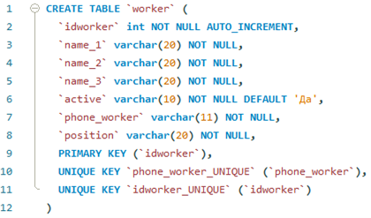

### Хранимые процедуры

Все операции записи и вход в систему выполняются **через хранимые процедуры**: логика работы с данными хранится в базе, а приложение только вызывает их через `cursor.callproc(...)`.

| Процедура | Что делает |
| --------- | ---------- |
| `check_client` | Проверяет, зарегистрирован ли клиент с таким телефоном и паролем, возвращает логическое значение |
| `log_in` | Аутентификация по телефону и паролю: возвращает признак успеха и должность (клиент, водитель или администратор) |
| `register_client` | Регистрирует нового клиента, если номер ещё не занят, иначе возвращает `FALSE` |
| `creating_order` | Создаёт заказ в `order_client` и возвращает его идентификатор |
| `update_order` | Обновляет заказ: состояние, смену, время и расстояние (в коде приложения вызывается как `update_order_worker`) |
| `update_order_state` | Меняет состояние заказа |
| `get_worker_and_car_info` | По номеру смены возвращает данные водителя и автомобиля: ФИО, модель, цвет |
| `insert_chat`, `update_chat_status` | Создание чата и смена его статуса (`Активен` / `Закрыт`) |
| `insert_message` | Добавление сообщения в чат |
| `insert_feedback` | Добавление отзыва с оценкой |
| `insert_service_rendered` | Фиксация обслуживания автомобиля |

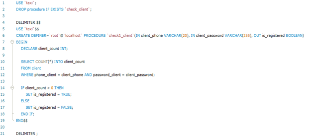

### Триггеры и журнал аудита

Для таблиц `car`, `chat`, `feedback`, `medical`, `message`, `order_client`, `service`, `service_rendered`, `work_shift` и `worker` созданы по три триггера: `BEFORE INSERT`, `BEFORE UPDATE` и `BEFORE DELETE`. Перед каждой операцией триггер записывает в таблицу `audit_log` время операции, имя таблицы, тип действия и данные записи в формате **JSON** (`old_data` / `new_data`). Это даёт полную историю изменений и позволяет откатить или восстановить данные.

Дополнительное бизнес-правило: перед вставкой номера смены в заказ проверяется, нет ли у этой смены активных заказов, то есть водитель не может одновременно выполнять два заказа.

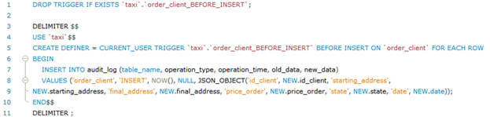

## Как приложение работает с базой данных

- **Подключение.** Параметры подключения (`host`, `user`, `password`, `db_name`) вынесены в `config.py`; соединение открывается через `mysql.connector`.
- **Запись** выполняется через хранимые процедуры, а **чтение** — через `SELECT` с **параметризованными запросами** (`%s`), что защищает от SQL-инъекций.
- **Роли** определяются при входе: процедура `log_in` возвращает должность, и приложение открывает окно клиента, водителя или администратора.
- **Обновление в реальном времени.** Окна ожидания и принятого заказа у клиента и водителя, а также список активных заказов водителя периодически опрашивают базу по таймеру (`QTimer`) и обновляют данные на экране.

### Жизненный цикл заказа

Заказ проходит состояния `Поиск` → `Выполнение` → `Завершен` (или `Отменен` по инициативе клиента).

## Интерфейс

Интерфейс (на русском языке) разделён по ролям: после входа открывается меню своей роли. Макеты окон созданы в Qt Designer (`ui maket/`).

| Роль | Основные разделы |
| ---- | ---------------- |
| Клиент | Заказать такси, Чат, Отзывы, История заказов, Помощь |
| Водитель | Активные заказы, Чат, О машине, История заказов, Отзывы, Помощь |
| Администратор | Заказы, Клиенты, Сотрудники, Автомобили, Отзывы, Чаты поддержки |

<table>
  <tr>
    <td align="center">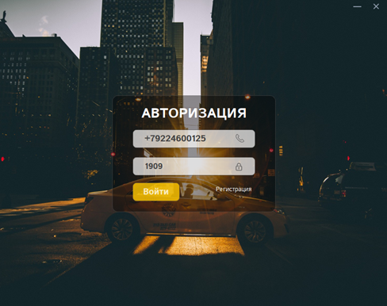<br><sub>Авторизация</sub></td>
    <td align="center">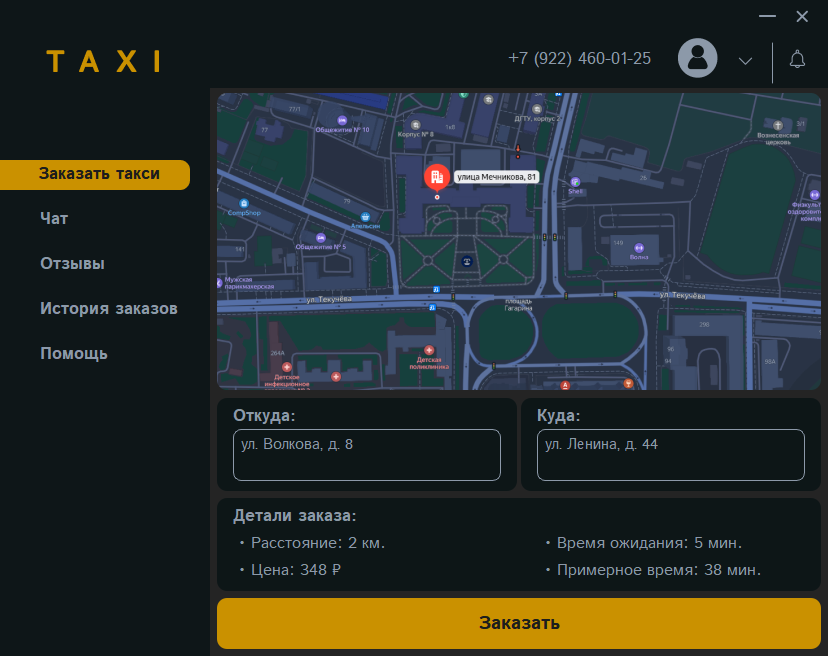<br><sub>Клиент: заказ такси</sub></td>
  </tr>
  <tr>
    <td align="center">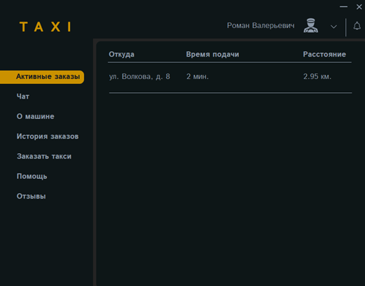<br><sub>Водитель: активные заказы</sub></td>
    <td align="center">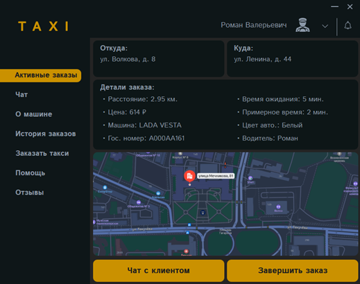<br><sub>Водитель: принятый заказ</sub></td>
  </tr>
  <tr>
    <td align="center">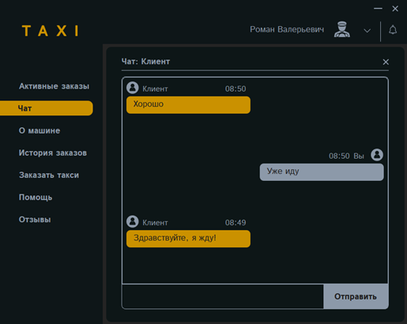<br><sub>Чат водителя и клиента</sub></td>
    <td align="center">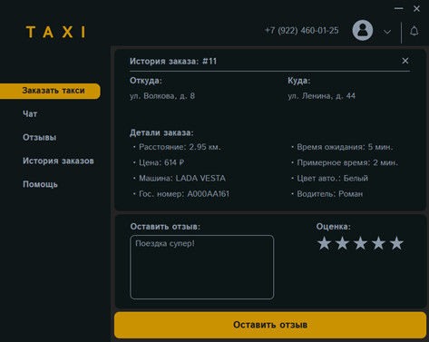<br><sub>Отзыв и оценка после поездки</sub></td>
  </tr>
</table>

## Архитектура приложения

Точка входа — `main.py`: окно авторизации (`MainWindow`) и регистрации (`RegisterWindow`). После входа открывается окно роли:

- `cl_int.py` — клиент (`ZakCl` и связанные окна: заказ, ожидание, чат, отзывы, история);
- `vod_int.py` — водитель (`Vodila`: активные заказы, принятый заказ, чат, обслуживание автомобиля, история);
- `adm_int.py` — администратор (`Admin`: заказы, клиенты, сотрудники, автомобили, отзывы, чаты поддержки).

Окна построены на базе классов, сгенерированных из макетов Qt Designer (`interface/`), и используют общие ресурсы (`image/`). UML-диаграмма классов:

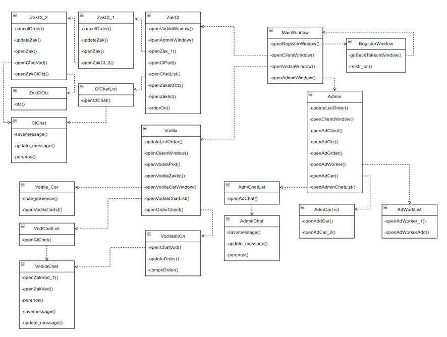

## Используемые технологии

| Технология | Для чего используется |
| ---------- | --------------------- |
| [Python 3](https://www.python.org/) | Язык клиентского приложения |
| [MySQL](https://www.mysql.com/) 8 | СУБД: таблицы, ключи, процедуры, триггеры |
| [MySQL Workbench](https://www.mysql.com/products/workbench/) | Моделирование схемы и разработка SQL-скриптов |
| [PyQt6](https://pypi.org/project/PyQt6/) | Графический интерфейс (`QtWidgets`, `QtCore`, `QtGui`), таймеры `QTimer` |
| Qt Designer | Макеты окон (`.ui`) |
| [`mysql-connector-python`](https://pypi.org/project/mysql-connector-python/) | Подключение к MySQL, вызов процедур (`callproc`) и запросы |
| `random`, `datetime`, `sys` | Стандартная библиотека |
| PyCharm Community | Среда разработки |

## Установка и запуск

1. Установите [Python 3](https://www.python.org/downloads/) и [MySQL Server 8](https://dev.mysql.com/downloads/mysql/).
2. Установите зависимости:

   ```bash
   pip install PyQt6 mysql-connector-python
   ```

3. Создайте базу данных `taxi` и импортируйте в неё дамп: таблицы, хранимые процедуры, триггеры и таблицу `audit_log`.

4. Укажите свои параметры подключения в `config.py`:

   ```python
   host = "localhost"
   user = "your_user"
   password = "your_password"
   db_name = "taxi"
   ```

5. Запустите приложение из корневой папки проекта:

   ```bash
   git clone https://github.com/DenkiGO/Taxi_app.git
   cd Taxi_app
   python main.py
   ```

Для корректного отображения интерфейса рекомендуется установить шрифт **Istok Web**.